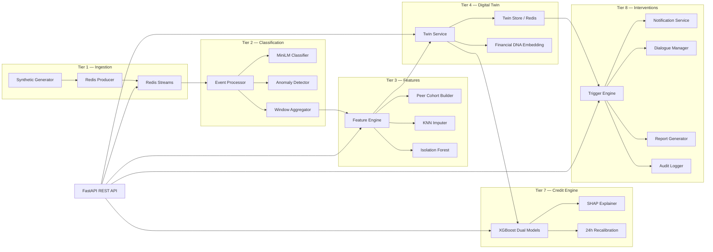

# Airavat Backend — Comprehensive Technical Deep-Dive

> **Airavat** — Real-Time Financial Behavioural Digital Twin & Cognitive Credit Engine

This document is an exhaustive guide to every component implemented in the backend, how it works, the mathematics behind it, why specific technologies were chosen, and how every API endpoint is wired together.

---

## Table of Contents

1. [High-Level Architecture](#1-high-level-architecture)
2. [Technology Stack & Rationale](#2-technology-stack--rationale)
3. [Project Structure](#3-project-structure)
4. [Configuration System](#4-configuration-system)
5. [Tier 1 — Signal Ingestion Layer](#5-tier-1--signal-ingestion-layer)
6. [Tier 2 — Semantic Classifier Layer](#6-tier-2--semantic-classifier-layer)
7. [Tier 3 — Behavioural Feature Engine](#7-tier-3--behavioural-feature-engine)
8. [Tier 4 — Digital Twin Model](#8-tier-4--digital-twin-model)
9. [Tier 7 — Cognitive Credit Engine](#9-tier-7--cognitive-credit-engine)
10. [Tier 8 — Intervention & Notification System](#10-tier-8--intervention--notification-system)
11. [API Reference — All Endpoints](#11-api-reference--all-endpoints)
12. [Data Flow & Pipeline Phases](#12-data-flow--pipeline-phases)
13. [Mathematical Foundations](#13-mathematical-foundations)
14. [Redis Key Schema](#14-redis-key-schema)
15. [Worker Processes & Consumer Groups](#15-worker-processes--consumer-groups)
16. [Testing Architecture](#16-testing-architecture)

---

## 1. High-Level Architecture

Airavat is built as a **multi-tier, event-driven pipeline** that transforms raw financial signals into a living Digital Twin per user, and then uses that twin to power credit scoring, AI-driven interventions, and conversational AI.



### Core Design Principles

| Principle | Implementation |
|-----------|---------------|
| **Event sourcing** | Every financial event is immutable; twin state is reconstructed from event stream |
| **Idempotency** | UUID `event_id` on every record; XADD deduplication |
| **Late-arrival tolerance** | Redis XADD uses server-assigned IDs; event-time windows handled in Tier 2 |
| **Auditability** | Every decision logged in sorted sets with epoch-ms timestamps |
| **Regulatory compliance** | RBI Digital Lending Directions, DPDPA 2023, TRAI — built into audit trail |

---

## 2. Technology Stack & Rationale

### Why FastAPI?

| Requirement | FastAPI Advantage |
|-------------|-------------------|
| Async I/O for Redis Streams | Native `async/await` with `asyncio` |
| Auto-docs for hackathon demos | Built-in Swagger UI at `/docs` |
| Pydantic integration | Same `BaseModel` used for schemas, validation, and API responses |
| Type safety | Full Python type hints with runtime validation |
| CORS middleware | One-liner for frontend integration |

FastAPI was chosen over Flask/Django because the entire architecture is **async-first** — Redis Streams, consumer groups, and pub/sub all require non-blocking I/O. FastAPI's native ASGI support (via Uvicorn) makes this trivial.

### Why Redis Streams (not Kafka)?

| Factor | Redis Streams | Kafka |
|--------|--------------|-------|
| Setup complexity | Zero config, single binary | Zookeeper + broker cluster |
| Latency | Sub-millisecond | 2-10ms |
| Consumer groups | Native `XREADGROUP` | More complex but battle-tested |
| Data size for hackathon | ~50K events fits in memory | Overkill |
| Lua scripting | Built-in for atomic ops | N/A |

Redis Streams provide the **exact semantics of Kafka** (consumer groups, acknowledgements, at-least-once delivery) with zero operational overhead. For a hackathon with 250 simulated users and ~500K events total, Redis is the optimal choice.

### Why Polars (not Pandas)?

| Factor | Polars | Pandas |
|--------|--------|--------|
| Memory model | Apache Arrow columnar | Row-major NumPy |
| Multi-threaded | Native Rayon parallelism | GIL-bound |
| Lazy evaluation | Yes (query optimiser) | No |
| Parquet I/O | Zero-copy via Arrow | Requires pyarrow anyway |
| API style | Expression-based (stateless) | Method-chaining (mutable) |

Polars was chosen because the feature engine processes **per-user grouped rolling windows** over 90 days of events — Polars' lazy evaluation and zero-copy Parquet reads make this 5-10x faster than Pandas.

### Why XGBoost?

| Factor | Rationale |
|--------|-----------|
| Tree-based | Handles mixed feature types (ratios, counts, flags) natively |
| Histogram method (`hist`) | O(n) training without sorting; scales to millions of rows |
| SHAP integration | Native `TreeExplainer` for feature attribution |
| Sparse matrix support | CSR input for thin-file users with many zero features |
| Production-proven | Used by CIBIL, Experian, and most NBFC credit scoring pipelines in India |

### Why sentence-transformers / MiniLM?

| Factor | Rationale |
|--------|-----------|
| Bi-encoder architecture | Pre-compute anchor embeddings once; cosine similarity at inference |
| `all-MiniLM-L6-v2` | 384-dim, 22M params, ~5ms per encode on CPU |
| LRU cache (4096 entries) | Repeated merchant names are sub-microsecond |
| Rule-based pre-filter | High-confidence keywords (salary, EMI, ATM) bypass ML entirely |

### Why SDV (Synthetic Data Vault)?

| Factor | Rationale |
|--------|-----------|
| Gaussian Copula synthesis | Preserves cross-field correlations (income ↔ UPI rate ↔ EMI burden) |
| Statistially valid data | Mean, variance, and joint distributions match real-world patterns |
| Privacy-safe | No real PII; all data is synthetic from the ground up |

### Complete Dependency Map

```
# API Layer
fastapi, uvicorn[standard], pydantic>=2.0, pydantic-settings

# Streaming / State
redis>=5.0

# Data Processing
polars, pyarrow, numpy, scipy

# ML / Embeddings
sentence-transformers>=2.7, scikit-learn, xgboost, shap

# Synthetic Data
faker, sdv

# Utilities
httpx, psutil
```

---

## 3. Project Structure

```
src/
├── __init__.py
├── api/
│   ├── __init__.py
│   └── main.py                  # FastAPI app — ALL 25+ REST endpoints
├── ingestion/                   # Tier 1 — Signal Ingestion
│   ├── __init__.py
│   ├── generator.py             # 1550-line synthetic data generator
│   ├── redis_producer.py        # Publishes events to Redis Streams
│   └── schemas.py               # CanonicalEvent + raw source schemas
├── classifier/                  # Tier 2 — Semantic Classification
│   ├── __init__.py
│   ├── merchant_classifier.py   # MiniLM bi-encoder + rule pre-filter
│   └── event_processor.py       # Stream consumer + window aggregator
├── features/                    # Tier 3 — Behavioural Feature Engine
│   ├── __init__.py
│   ├── engine.py                # 1066-line feature extraction engine
│   ├── peer_cohort.py           # Peer cohort Parquet builder
│   └── schemas.py               # BehaviouralFeatureVector (18+ features)
├── twin/                        # Tier 4 — Digital Twin
│   ├── __init__.py
│   ├── twin_model.py            # DigitalTwin Pydantic schema + Financial DNA
│   ├── twin_service.py          # Update lifecycle + persona inference
│   ├── twin_store.py            # Redis persistence + history snapshots
│   └── twin_embedding.py        # Cosine similarity + DNACohortIndex
├── scoring/                     # Tier 4 (Offline Trainer)
│   ├── __init__.py
│   └── trainer.py               # XGBoost training pipeline
├── credit/                      # Tier 7 — Cognitive Credit Engine
│   ├── __init__.py
│   ├── credit_scorer.py         # Dual XGBoost inference + EL sizing
│   ├── credit_trainer.py        # Thin alias to scoring/trainer.py
│   ├── recalibration.py         # 24h APScheduler sweep
│   ├── scoring_worker.py        # Async saga consumer
│   ├── shap_explainer.py        # SHAP TreeExplainer wrapper
│   └── schemas.py               # CreditScoreResult, BehaviouralOverride
└── intervention/                # Tier 8 — Intervention System
    ├── __init__.py
    ├── trigger_engine.py         # 7 trigger types + relevance scoring
    ├── agent_orchestrator.py     # Autonomous Listen→Evaluate→Act loop
    ├── dialogue_manager.py       # Avatar chat intelligence
    ├── report_generator.py       # EOD/weekly reports
    ├── notification_service.py   # Multi-channel dispatch (SMS/Push/WhatsApp)
    └── audit_logger.py           # Immutable sorted-set audit trail
```

---

## 4. Configuration System

[settings.py](file:///c:/HACK_PROJECTS/Airavat/config/settings.py)

Uses **Pydantic Settings** (`pydantic-settings`) for type-safe, env-file-backed configuration:

```python
class Settings(BaseSettings):
    redis_url: str = "redis://localhost:6379/0"
    stream_maxlen: int = 50_000

    # Stream names for each source
    stream_bank: str = "stream:bank_transactions"
    stream_upi: str = "stream:upi_transactions"
    stream_sms: str = "stream:sms_alerts"
    stream_emi: str = "stream:recurring_schedules"
    stream_ob: str = "stream:open_banking"
    stream_voice: str = "stream:voice_transcripts"

    # Inter-tier streams
    stream_typed: str = "stream:typed_events"    # Tier 2 → Tier 3
    stream_features: str = "stream:behavioural_features"  # Tier 3 → Tier 4

    # ML config
    embedding_model: str = "all-MiniLM-L6-v2"
    similarity_threshold: float = 0.50
    lru_cache_size: int = 4096

    # LLM (for production chat — currently rule-based)
    openrouter_api_key: str = ""
    llm_model: str = "google/gemma-3-4b-it:free"
```

**Why Pydantic Settings?** — Auto-loads from `.env` files, validates types at startup, and provides a single source of truth for all configuration across the entire application. If `redis_url` is malformed, the app **fails fast** at startup, not at the first Redis call 10 minutes in.

---

## 5. Tier 1 — Signal Ingestion Layer

### Purpose

Transform raw multi-source financial signals (bank statements, UPI transactions, SMS alerts, EMI schedules, open banking feeds, voice transcripts, GST invoices, e-Way bills) into a unified `CanonicalEvent` stream.

### Files

| File | Lines | Role |
|------|-------|------|
| [generator.py](file:///c:/HACK_PROJECTS/Airavat/src/ingestion/generator.py) | 1550 | Synthetic data generator (6 retail + 2 MSME sources) |
| [redis_producer.py](file:///c:/HACK_PROJECTS/Airavat/src/ingestion/redis_producer.py) | 134 | Async batch publisher to Redis Streams |
| [schemas.py](file:///c:/HACK_PROJECTS/Airavat/src/ingestion/schemas.py) | 200 | Pydantic schemas for all 8 source types + unified event |

### 5.1 The CanonicalEvent Schema

Every raw source is normalised into this single unified schema:

```python
class CanonicalEvent(BaseModel):
    event_id: str              # UUID — idempotency key
    user_id: str               # Hashed identifier (no real PII)
    timestamp: datetime        # ISO 8601
    amount: float              # Signed INR: +ve=inflow, -ve=outflow
    merchant_name: str         # Raw string (classified by Tier 2)
    channel: ChannelEnum       # BANK_TRANSFER | UPI | CARD | ATM | EMI | OTHER
    balance_after: float?      # Post-transaction balance (if available)
    reference_id: str?         # Source-specific reference
    source_provenance: str     # bank_api | upi_api | sms_parser | ...
    status: StatusEnum         # SUCCESS | PENDING | FAILED
    recurrence_flag: bool      # True for EMI/subscription payments
    anomaly_flag: bool         # Set by Tier 2 anomaly detector

    # Filled by Tier 2 classifier (None at ingestion)
    transaction_type: str?     # INCOME | EXPENSE_ESSENTIAL | EMI_PAYMENT | ...
    merchant_category: str?    # SALARY | GROCERY | DINING | ...
    classifier_confidence: float?  # [0.0, 1.0]
```

### 5.2 Synthetic Data Generator — The Mathematical Core

The generator creates statistically realistic financial data using:

#### 5.2.1 SDV Gaussian Copula Profile Synthesis

```python
# 5 persona types with real-world-calibrated weights
PERSONA_TYPES = [
    "genuine_healthy",      # 40% — stable income, low EMI burden
    "genuine_struggling",   # 25% — irregular income, high debt
    "shell_circular",       # 15% — round-tripping UPI fraud pattern
    "paper_trader",         # 10% — GST invoice manipulation
    "new_to_credit",        # 10% — thin file, short history
]
```

The SDV GaussianCopulaSynthesizer fits a **Gaussian copula** to seed data:

$$C(u_1, u_2, ..., u_d) = \Phi_R\big(\Phi^{-1}(u_1), \Phi^{-1}(u_2), ..., \Phi^{-1}(u_d)\big)$$

Where:
- $\Phi_R$ = multivariate CDF with correlation matrix $R$
- $\Phi^{-1}$ = inverse standard normal CDF
- $u_i$ = marginal CDFs of each feature

This ensures **cross-field correlations** are preserved. For example:
- `SHELL_CIRCULAR` profiles have **high UPI rate (5–15/day) AND high income ($80K–$1M) AND near-zero EMI overdue probability** — because shell companies need high throughput with no failed transactions.
- `GENUINE_STRUGGLING` profiles have **low income ($10K–$80K) AND high overdue probability (15–35%) AND low UPI rate (0.5–2/day)** — mimicking real struggling consumers.

#### 5.2.2 Lognormal Amount Distribution

Transaction amounts follow:

$$X \sim \text{LogNormal}(\mu, \sigma)$$

Calibrated per persona:

| Persona | μ (bank) | σ (bank) | μ (UPI) | σ (UPI) |
|---------|----------|----------|---------|---------|
| genuine_healthy | 10.8 | 0.8 | 9.5 | 0.9 |
| genuine_struggling | 9.9 | 1.2 | 8.8 | 1.1 |
| shell_circular | 12.2 | 0.4 | 11.5 | 0.5 |
| paper_trader | 12.6 | 0.3 | 10.0 | 0.7 |
| new_to_credit | 9.6 | 1.5 | 8.2 | 1.3 |

Why lognormal? Because financial transaction amounts in the real world exhibit heavy right-tail distributions — most txns are small, but a few are very large (salary, rent, investments). The lognormal captures this naturally.

#### 5.2.3 Temporal Arrival Process

**Genuine users**: Exponential inter-arrivals (Poisson process):

$$\Delta t_i \sim \text{Exp}\left(\frac{T}{n}\right)$$

Where $T$ = total time span, $n$ = expected events. This produces realistic irregular spacing.

**Shell/circular fraud**: Gaussian burst clusters:

$$t_i \sim \mathcal{N}\left(c_k, \, \sigma_\text{burst}\right)$$

Where $c_k$ is one of 2–3 random burst centers and $\sigma_\text{burst} = 0.04 \times T$. This creates **temporal clustering** — a telltale sign of round-tripping fraud where many transactions happen in short bursts.

#### 5.2.4 Circular Ring Topology (Shell Fraud)

`SHELL_CIRCULAR` profiles are grouped into rings of 3–4 users. Each user sends 70% of their UPI transactions to the **next member in the ring**:

```
User A → User B → User C → User D → User A  (circular flow)
```

This creates the distinctive **graph topology** of round-tripping fraud visible in Tier 3 features.

#### 5.2.5 Generated Data Sources (8 total)

| Source | Rows per 100 users | Key fields |
|--------|-------------------|------------|
| Bank transactions | ~120K | amount, merchant, balance, channel |
| UPI transactions | ~200K | amount, direction, counterparty, txn_type |
| SMS alerts | ~240K | raw_text, extracted_amount, alert_type |
| EMI schedules | ~8K | tenure, overdue status, recurrence |
| Open banking | ~110K | daily balance snapshots |
| Voice transcripts | ~250 | extracted_amount, confidence_score |
| GST invoices | ~15K | taxable_value, filing_status, buyer_gstin |
| E-Way bills | ~12K | HSN codes, transport distance, tax breakdown |

### 5.3 Redis Producer

The [redis_producer.py](file:///c:/HACK_PROJECTS/Airavat/src/ingestion/redis_producer.py) publishes to **two streams simultaneously**:

1. **Source-specific stream** (`stream:bank_transactions`, `stream:upi_transactions`, etc.)
2. **Unified raw stream** (`stream:raw_ingestion`) — consumed by Tier 2

Key design decisions:
- **Batched publishing** (10,000 events per pipeline flush) — reduces Redis round-trips by 10,000x
- **`MAXLEN ~50000`** — approximate trimming keeps stream bounded without O(n) overhead
- **Consumer groups** pre-created with `XGROUP CREATE ... MKSTREAM` — stream auto-creates if absent

---

## 6. Tier 2 — Semantic Classifier Layer

### Purpose

Enrich every raw financial event with machine-learned merchant categorisation, transaction types, and anomaly flags.

### Files

| File | Lines | Role |
|------|-------|------|
| [merchant_classifier.py](file:///c:/HACK_PROJECTS/Airavat/src/classifier/merchant_classifier.py) | 263 | MiniLM bi-encoder + rule pre-filter |
| [event_processor.py](file:///c:/HACK_PROJECTS/Airavat/src/classifier/event_processor.py) | 272 | Stream consumer + sliding-window aggregator |

### 6.1 Merchant Classification Pipeline

```
Raw merchant string
    ↓
[1] Rule-based pre-filter (regex patterns)
    → If match: return immediately (confidence=1.0)
    ↓
[2] LRU cache lookup (maxsize=4096)
    → If hit: return cached result (sub-microsecond)
    ↓
[3] MiniLM embedding → 384-dim normalised vector
    ↓
[4] Cosine similarity vs 16 pre-computed anchor vectors
    ↓
[5] If max_score ≥ 0.50: assign category
    Else: assign "OTHER"
    ↓
[6] Amount-sign override:
    If amount > 0 and type ∉ {INCOME, TRANSFER, REFUND}
    → Override to INCOME
```

#### 6.1.1 Anchor Embedding Mathematics

For each of the 16 merchant categories, we pre-compute a mean embedding from 5–10 anchor phrases:

$$\mathbf{a}_c = \frac{1}{|P_c|} \sum_{p \in P_c} \text{MiniLM}(p)$$

Then normalise:

$$\hat{\mathbf{a}}_c = \frac{\mathbf{a}_c}{\|\mathbf{a}_c\|_2}$$

At inference, for a merchant string $m$:

$$\text{sim}(m, c) = \hat{\mathbf{v}}_m \cdot \hat{\mathbf{a}}_c$$

Since both vectors are L2-normalised, the dot product **equals** cosine similarity. No explicit division needed.

#### 6.1.2 The 16 Merchant Categories

```
SALARY, GROCERY, DINING, TRANSPORT, BILLS_UTILITIES, HEALTHCARE,
ENTERTAINMENT, EMI, SUBSCRIPTION, EDUCATION, RENT, INSURANCE,
CASH_ATM, INVESTMENT, TRANSFER, OTHER
```

Each maps to a `TransactionType`:

| Category | Transaction Type |
|----------|-----------------|
| SALARY | INCOME |
| GROCERY, TRANSPORT, BILLS, HEALTHCARE, RENT, INSURANCE | EXPENSE_ESSENTIAL |
| DINING, ENTERTAINMENT, EDUCATION, CASH_ATM | EXPENSE_DISCRETIONARY |
| EMI | EMI_PAYMENT |
| SUBSCRIPTION | SUBSCRIPTION |
| INVESTMENT | INVESTMENT |
| TRANSFER | TRANSFER |

### 6.2 Anomaly Detection

Three rule-based anomaly checks:

| Rule | Condition | Rationale |
|------|-----------|-----------|
| **Failed transaction** | `status == "FAILED"` | Direct signal of stress |
| **Z-score spike** | $\frac{|a| - \mu}{\sigma} > 3.0$ (over last 200 txns) | Statistical outlier |
| **Velocity burst** | >5 events in 60 minutes for same user | Shell/fraud pattern |

### 6.3 Sliding Window Aggregator

Per-user in-memory `WindowBuffer` maintains a deque of `(timestamp, amount, category, txn_type)` tuples. On every event:

1. Push to deque
2. Prune entries older than 91 days
3. Compute 7d / 30d / 90d aggregates:

| Metric | Formula |
|--------|---------|
| `{w}d_total_income` | $\sum_{t \in [w]} a_i \cdot \mathbb{1}[\text{type}=\text{INCOME}]$ |
| `{w}d_total_essential` | $\sum_{t \in [w]} |a_i| \cdot \mathbb{1}[\text{type}=\text{ESSENTIAL}]$ |
| `{w}d_net_cashflow` | $\text{income} - \text{essential} - \text{discretionary} - \text{EMI} - \text{subs}$ |
| `{w}d_category_breakdown` | Per-category absolute spending totals |

Stored in Redis as JSON at `twin:windows:{user_id}`.

---

## 7. Tier 3 — Behavioural Feature Engine

### Purpose

Compute 18+ behavioural features per user from classified event history. These features are the **input contract** for the Digital Twin (Tier 4) and Credit Scorer (Tier 7).

### Files

| File | Lines | Role |
|------|-------|------|
| [engine.py](file:///c:/HACK_PROJECTS/Airavat/src/features/engine.py) | 1066 | Core feature computation + offline batch |
| [peer_cohort.py](file:///c:/HACK_PROJECTS/Airavat/src/features/peer_cohort.py) | 140 | Cohort aggregation (income_band × city_tier × age_group) |
| [schemas.py](file:///c:/HACK_PROJECTS/Airavat/src/features/schemas.py) | 104 | BehaviouralFeatureVector Pydantic schema |

### 7.1 The 18 Core Behavioural Features

#### Cash Flow & Liquidity (§1, §2)

| Feature | Formula | Interpretation |
|---------|---------|----------------|
| `daily_avg_throughput_30d` | $\frac{\text{EMA}_{30}(\|a_i\|)}{30}$, half-life=30d | Average daily money moving through the account |
| `cash_buffer_days` | $\min\left(\frac{\text{inbound}_{30}}{(\text{outflow}_{30} / 30)}, 90\right)$ | How many days cash reserves would last |
| `debit_failure_rate_90d` | $\frac{\text{count}(\text{FAILED}, a<0)}{\text{count}(a<0)}$ over 90d | Rate of bounced/failed outgoing transactions |
| `end_of_month_liquidity_dip` | $\text{avg}(\text{net}_{d\geq25} - \text{net}_{d<25})$ per month | Cash drain in last week of month |

#### Behavioural Ratios (§3)

| Feature | Formula | Interpretation |
|---------|---------|----------------|
| `emi_burden_ratio` | $\frac{\text{EMI}_{30} + \text{subs}_{30}}{\text{income}_{30}}$ | Debt servicing as fraction of income |
| `savings_rate` | $\frac{\text{income} - \text{essential} - \text{discretionary}}{\text{income}}$ clipped to [-1, 1] | Net savings as fraction of income |
| `income_stability_score` | $\max(0, 1 - \text{CV}(\text{income}_{90d}))$ | Coefficient of variation inverted: 1=perfectly stable |
| `spending_volatility_index` | $\frac{\sigma(\text{daily\_expense})}{\mu(\text{daily\_expense})}$ over 90d | How erratic spending is day-to-day |
| `discretionary_ratio` | $\frac{\text{disc}_{90}}{\text{total\_expense}_{90}}$ | Proportion of non-essential spending |
| `cash_dependency_index` | $\frac{\text{ATM\_withdrawals}_{90}}{\text{total\_outflows}_{90}}$ | Reliance on informal (cash) economy |

#### Recurrence & Pattern (§4)

| Feature | Formula | Interpretation |
|---------|---------|----------------|
| `subscription_count_30d` | Count of SUBSCRIPTION-type events | Active recurring services |
| `emi_payment_count_90d` | Count of EMI_PAYMENT events | Active loan/EMI accounts |
| `salary_day_spike_flag` | $\text{disc\_spend}_{±3d\_salary} > 1.25 \times \text{baseline\_disc}$ | Post-salary spending impulse |
| `lifestyle_inflation_trend` | $\frac{\text{disc\_month}_n - \text{disc\_month}_{n-1}}{\text{disc\_month}_{n-1}}$ | Month-on-month discretionary spend increase |
| `merchant_category_shift_count` | $|\text{top5}_{30d} \triangle \text{top5}_{prev30d}|$ | Symmetric difference of top-5 spending categories |

#### Anomaly & Concentration (§5)

| Feature | Formula | Interpretation |
|---------|---------|----------------|
| `anomaly_flag` | `True` if >2 FAILED transactions in 90d | Broad stress signal |
| `top3_merchant_concentration` | $\sum_{i=1}^{3} \left(\frac{s_i}{\sum s}\right)^2$ (HHI) | Herfindahl–Hirschman Index for spend concentration |
| `peer_cohort_benchmark_deviation` | $\frac{\text{emi\_burden} - \mu_\text{cohort}}{\sigma_\text{cohort}}$ | Z-score vs peers of same income/city/age |

### 7.2 EMA Weighting

All time-sensitive aggregations use **Exponential Moving Average** weighting:

$$\text{EMA}(t_i, v_i) = \sum_i v_i \cdot e^{-\lambda \cdot \Delta t_i}$$

where $\lambda = \frac{\ln 2}{T_{1/2}}$ and $\Delta t_i = (t_\text{ref} - t_i)$ in days.

For `daily_avg_throughput_30d`, $T_{1/2} = 30$ days. This means an event from 30 days ago contributes half the weight of today's event, and an event from 60 days ago contributes 25%.

### 7.3 Offline Batch Processing

The batch engine ([engine.py](file:///c:/HACK_PROJECTS/Airavat/src/features/engine.py) line 841+):

1. **Loads** all raw Parquet chunks from `data/raw/`
2. **Merges** bank + UPI + EMI + open-banking + SMS into a unified events frame
3. **Per-user**: builds `UserEventStore`, computes all 18 features + MSME features
4. **Post-processing**:
   - **KNN Imputer** (k=5): fills missing GST/EWB features using income-related columns as reference
   - **Isolation Forest** (contamination=5%): flags temporal anomalies in cadence features
5. **Writes** partitioned Parquet: `data/features/user_id={uid}/features.parquet`

### 7.4 MSME Feature Extensions

For users with GSTIN (business accounts), additional features:

| Feature | Formula |
|---------|---------|
| `gst_30d_value` | EMA-weighted sum of taxable values (30d half-life) |
| `ewb_30d_value` | EMA-weighted sum of e-Way bill values |
| `gst_filing_compliance_rate` | $\frac{\text{count(ontime)}}{\text{count(total)}}$ |
| `upi_p2m_ratio_30d` | $\frac{\text{P2M inbound}}{\text{total inbound}}$ |
| `gst_upi_receivables_gap` | $\frac{\text{GST value} - \text{UPI receivables}}{\text{GST value}}$ |
| `hsn_entropy_90d` | $-\sum_i p_i \ln(p_i)$ over HSN code distribution |
| `statutory_payment_regularity_score` | $\max(0, 1 - \text{avg\_delay}/30)$ |

### 7.5 Peer Cohort Builder

[peer_cohort.py](file:///c:/HACK_PROJECTS/Airavat/src/features/peer_cohort.py) segments users by:

$$\text{cohort\_key} = \text{income\_band} \times \text{city\_tier} \times \text{age\_group}$$

Example: `"mid_1_26-35"` = mid-income users in Tier-1 cities aged 26–35.

Per cohort, computes mean and std of 5 key features for z-score benchmarking.

---

## 8. Tier 4 — Digital Twin Model

### Purpose

Maintain a living, versioned, probabilistic representation of each user's financial identity — updated in real-time as new events arrive.

### Files

| File | Lines | Role |
|------|-------|------|
| [twin_model.py](file:///c:/HACK_PROJECTS/Airavat/src/twin/twin_model.py) | 230 | DigitalTwin schema + Financial DNA builder |
| [twin_service.py](file:///c:/HACK_PROJECTS/Airavat/src/twin/twin_service.py) | 253 | Update lifecycle + metric derivation |
| [twin_store.py](file:///c:/HACK_PROJECTS/Airavat/src/twin/twin_store.py) | 110 | Redis persistence + history snapshots |
| [twin_embedding.py](file:///c:/HACK_PROJECTS/Airavat/src/twin/twin_embedding.py) | 64 | Cosine similarity + cohort index |
| [trainer.py](file:///c:/HACK_PROJECTS/Airavat/src/scoring/trainer.py) | 374 | XGBoost offline training pipeline |

### 8.1 Digital Twin State

```python
class DigitalTwin(BaseModel):
    user_id: str
    persona: PersonaType           # genuine_healthy | shell_circular | ...
    risk_score: float              # [0, 1] — sigmoid-smoothed composite
    liquidity_health: str          # LOW | MEDIUM | HIGH
    income_stability: float        # [0, 1]
    spending_volatility: float     # [0, 1]
    cash_buffer_days: float        # [0, 90]
    emi_burden_ratio: float        # [0, ∞)
    financial_dna: list[float]     # 32-dim behavioural embedding
    avatar_state: AvatarState      # expression + mood message
    version: int                   # monotonically increasing
    risk_history: list[float]      # last 20 risk scores (trajectory)
```

### 8.2 Risk Score Derivation

The composite risk score uses a **weighted non-linear combination** with sigmoid smoothing:

$$\text{raw} = \underbrace{0.25 \cdot \frac{\min(\text{emi}, 2)}{2}}_{\text{EMI burden}} + \underbrace{0.20 \cdot \text{fail\_rate}}_{\text{debit failures}} + \underbrace{0.15 \cdot \frac{\min(\text{vol}, 3)}{3}}_{\text{spending volatility}} + \underbrace{0.10 \cdot \frac{\min(\text{dip}, 50k)}{50k}}_{\text{EOM dip}}$$

$$+ \underbrace{0.05 \cdot \text{disc\_ratio}}_\text{discretionary} + \underbrace{0.05 \cdot \text{cash\_dep}}_\text{cash} - \underbrace{0.15 \cdot \max(\text{savings}, 0)}_\text{savings (protective)} - \underbrace{0.05 \cdot \text{stability}}_\text{income (protective)}$$

Then sigmoid-smoothed:

$$\text{risk\_score} = \frac{1}{1 + e^{-(6 \cdot \text{raw} - 3)}}$$

This maps the raw value through a sigmoid centered at 0.5, producing a smooth [0, 1] output where:
- 0.0 = excellent financial health
- 1.0 = severe financial distress

### 8.3 CIBIL-Like Score

$$\text{CIBIL} = 900 - \text{risk\_score} \times 600$$

| risk_score | CIBIL Range | Band |
|-----------|-------------|------|
| 0.0 – 0.25 | 750 – 900 | Excellent |
| 0.25 – 0.42 | 650 – 749 | Good |
| 0.42 – 0.58 | 550 – 649 | Average |
| 0.58 – 1.0 | 300 – 549 | Needs Attention |

### 8.4 Financial DNA Embedding (32-dim)

A **deterministic behavioural fingerprint** for each user:

1. **Normalise** 20 key features to [0, 1] using fixed range clips:

$$x_i = \text{clip}\left(\frac{f_i - \text{lo}_i}{\text{hi}_i - \text{lo}_i}, 0, 1\right)$$

2. **Compute 12 interaction terms** (pairwise products):

$$\text{interact}_k = x_a \cdot x_b$$

Key pairs include: (spending_volatility × peer_deviation), (cash_buffer × debit_failure), (emi_burden × savings_rate), etc.

3. **Linear projection** through a fixed random matrix $W \in \mathbb{R}^{32 \times 32}$:

$$\text{DNA} = \text{clip}\left(\frac{W \cdot [\mathbf{x}; \mathbf{interact}]}{32}, 0, 1\right)$$

The weight matrix $W$ is seeded with `0xC0FFEE` for reproducibility.

**Why this approach?** It creates a dense, fixed-dimensionality representation that captures both individual features AND their interactions. Two users with similar spending patterns but different income stability will have different DNA vectors, enabling cosine-similarity-based peer matching.

### 8.5 Persona Inference

Rule-based persona classification from feature signals:

```python
if top3_concentration > 0.80 AND debit_failure > 0.30 AND throughput > 100K:
    → "shell_circular"
elif volatility > 1.5 AND throughput > 50K AND stability < 0.4:
    → "paper_trader"
elif income_90d < 30K AND emi_count == 0 AND throughput < 2K:
    → "new_to_credit"
elif emi_burden > 0.55 AND savings_rate < 0.05:
    → "genuine_struggling"
else:
    → keep existing persona (or "genuine_healthy")
```

### 8.6 Avatar State Machine

```
     risk_score LOW    → "calm" face
     risk_score MEDIUM → "concerned" face
     risk_score HIGH   → "urgent" face
     persona = new_to_credit → "educational" face (override)
     persona = shell_circular → "concerned" face (override)
```

Each expression maps to a mood message in the frontend avatar.

### 8.7 Version History & Event Sourcing

Every twin update:
1. Increments `version`
2. `SET twin:{user_id}` (current state)
3. `LPUSH twin:{user_id}:history` (immutable snapshot)
4. `LTRIM twin:{user_id}:history 0 99` (cap at 100 snapshots)
5. `PUBLISH twin_updated <summary>` (triggers Tier 8 agent)

---

## 9. Tier 7 — Cognitive Credit Engine

### Purpose

Generate CIBIL-like credit scores using XGBoost ML models with full SHAP explainability, EL-based loan sizing, and 24-hour automatic recalibration.

### Files

| File | Lines | Role |
|------|-------|------|
| [credit_scorer.py](file:///c:/HACK_PROJECTS/Airavat/src/credit/credit_scorer.py) | 303 | Dual model inference + EL sizing |
| [scoring_worker.py](file:///c:/HACK_PROJECTS/Airavat/src/credit/scoring_worker.py) | 285 | Async saga consumer for score requests |
| [shap_explainer.py](file:///c:/HACK_PROJECTS/Airavat/src/credit/shap_explainer.py) | 98 | SHAP TreeExplainer wrapper |
| [recalibration.py](file:///c:/HACK_PROJECTS/Airavat/src/credit/recalibration.py) | 161 | 24-hour APScheduler sweep |
| [schemas.py](file:///c:/HACK_PROJECTS/Airavat/src/credit/schemas.py) | 67 | CreditScoreResult + BehaviouralOverride |
| [trainer.py](file:///c:/HACK_PROJECTS/Airavat/src/scoring/trainer.py) | 374 | XGBoost training (shared with Tier 4) |

### 9.1 Dual Model Architecture

```
BehaviouralFeatureVector (28 features)
    ↓
[Auto-route based on data_completeness_score]
    ↓
if completeness < 0.7:             if completeness ≥ 0.7:
  xgb_digital_twin_income_heavy     xgb_digital_twin (full)
  (discretionary cols zeroed)       (all 28 features active)
    ↓                                  ↓
P(default) → credit_score 300-900 → risk_band → loan sizing
```

**Why two models?** Thin-file users (new_to_credit) have sparse discretionary spending data. The income-heavy model zeros out volatile features like `discretionary_ratio`, `lifestyle_inflation_trend`, and `subscription_count_30d`, relying instead on income stability and EMI burden — more robust signals when data is scarce.

### 9.2 The 33 Feature Columns (Training Contract)

```python
FEATURE_COLUMNS = [
    # Cash-flow & Liquidity (4)
    "daily_avg_throughput_30d", "cash_buffer_days",
    "debit_failure_rate_90d", "end_of_month_liquidity_dip",
    # Behavioural Ratios (6)
    "emi_burden_ratio", "savings_rate", "income_stability_score",
    "spending_volatility_index", "discretionary_ratio", "cash_dependency_index",
    # Recurrence & Pattern (4)
    "subscription_count_30d", "emi_payment_count_90d",
    "lifestyle_inflation_trend", "merchant_category_shift_count",
    # Anomaly & Concentration (3)
    "top3_merchant_concentration", "peer_cohort_benchmark_deviation",
    "temporal_anomaly_flag",
    # Sliding Windows (9)
    "income_7d", "income_30d", "income_90d",
    "essential_30d", "essential_90d",
    "discretionary_30d", "discretionary_90d",
    "net_cashflow_30d", "net_cashflow_90d",
    # Completeness (1)
    "data_completeness_score",
    # MSME Features (6)
    "gst_30d_value", "ewb_30d_value", "gst_filing_compliance_rate",
    "upi_p2m_ratio_30d", "gst_upi_receivables_gap",
    "hsn_entropy_90d", "statutory_payment_regularity_score", "months_active_gst",
]
```

### 9.3 Score Derivation Mathematics

$$\text{score} = 900 - P(\text{default}) \times 600$$

$$\text{score} \in [300, 900]$$

### 9.4 Proxy Label Generation (Training)

Since we don't have real default labels, the trainer generates **rule-based noisy proxy labels**:

Starting from base score 0.3:
- `emi_burden > 0.5` → **+0.30**
- `savings_rate < 0` → **+0.25**
- `cash_buffer < 10` → **+0.20**
- `debit_failure > 0.1` → **+0.20**
- `gst_compliance < 0.8` → **+0.15** (MSME)
- `income_stability > 0.85` → **-0.07**
- Gaussian noise σ=0.08 added for diversity

Binary threshold at 0.5 → XGBoost target.

### 9.5 Expected Loss (EL) Based Loan Sizing

$$\text{EL} = P(\text{default}) \times \text{LGD} \times \text{EAD}$$

Where:
- $\text{LGD} = 0.45$ (Loss Given Default — unsecured personal lending standard)
- $\text{Max acceptable EL} = ₹25,000$

Solving for maximum loan amount:

$$\text{max\_loan} = \min\left(\frac{₹25{,}000}{P(\text{default}) \times 0.45}, \text{band\_cap}\right)$$

| Risk Band | Score Range | Max Loan (₹L) | APR Range | CGTMSE Eligible |
|-----------|------------|----------------|-----------|-----------------|
| Very Low Risk | 750–900 | 20L | 8.5–11% | ✅ |
| Low Risk | 650–749 | 10L | 11–14% | ✅ |
| Medium Risk | 550–649 | 5L | 14–18% | ❌ |
| High Risk | 300–549 | 1L | 18–24% | ❌ |

### 9.6 Behavioural Trajectory Override

When the Digital Twin shows **improving risk trajectory** (decreasing risk over multiple versions):

$$\delta = \max(\text{risk\_history}[-1] - \text{risk\_history}[0], 0)$$

$$\text{boost} = \min(\lfloor\delta \times 50\rceil, 75)$$

This rewards users who are actively improving their financial behaviour — addressing a fundamental limitation of static bureau scores.

### 9.7 SHAP Explainability

For every score, SHAP TreeExplainer computes:
- **Top-5 features** by |SHAP value| with direction (increases/decreases risk)
- **Waterfall data**: base_value + contribution chain → final prediction
- All stored in `score:{task_id}` hash for API retrieval

### 9.8 Rule Trace (Audit Compliance)

Every scoring decision includes machine-readable pass/fail for 9 rule checks:

| Check | Threshold | RBI Relevance |
|-------|-----------|---------------|
| EMI burden | ≤ 0.5 | Fair Lending Practices |
| Savings rate | ≥ 0.0 | Affordability assessment |
| Cash buffer | ≥ 15 days | Liquidity adequacy |
| Debit failure | ≤ 0.1 | Credit risk indicator |
| Income stability | ≥ 0.5 | Income verification |
| Anomaly flag | False | Fraud screening |
| Net cashflow | ≥ 0 | Repayment capacity |
| GST compliance | ≥ 0.8 | MSME risk assessment |
| Receivables gap | ≤ 0.4 | Revenue verification |

### 9.9 24-Hour Recalibration

[recalibration.py](file:///c:/HACK_PROJECTS/Airavat/src/credit/recalibration.py) runs an APScheduler job every 24 hours:

1. Scan all users in `credit:active` set
2. For each user: load latest feature parquet
3. If `daily_avg_throughput_30d` changed by ±15%: re-score
4. Update `credit:user:{uid}` hash
5. If loan limit REDUCED by >5%: publish `LIMIT_REDUCED_EVENT` on `credit_events` channel

### 9.10 Scoring Saga Worker

The async worker ([scoring_worker.py](file:///c:/HACK_PROJECTS/Airavat/src/credit/scoring_worker.py)) follows a **saga pattern**:

```
XREADGROUP stream:credit_score_requests
    ↓
[1] Resolve features → BehaviouralFeatureVector
[2] Read Digital Twin risk_history → trajectory delta
[3] Auto-route model (full vs income-heavy)
[4] Score → CreditScorer.score()
[5] Explain → CreditExplainer.explain_single()
[6] Write result → HSET score:{task_id}
[7] Register user → SADD credit:active
[8] Publish progress → PUBLISH updates:{task_id}
```

Real-time SSE progress available at `/credit/score/{task_id}/stream`.

---

## 10. Tier 8 — Intervention & Notification System

### Purpose

Autonomously monitor user twins, fire context-aware triggers, dispatch multi-channel notifications, power avatar conversations, generate reports, and maintain a full audit trail.

### 10.1 Trigger Engine

[trigger_engine.py](file:///c:/HACK_PROJECTS/Airavat/src/intervention/trigger_engine.py) — 7 trigger types:

| # | Trigger | Condition | Priority | Channels |
|---|---------|-----------|----------|----------|
| 1 | `liquidity_drop` | `liquidity == LOW` OR `cash_buffer < 10` | HIGH | SMS + Push |
| 2 | `overspend_warning` | `spending_volatility > 0.65` | MEDIUM | Push |
| 3 | `emi_at_risk` | `emi_burden > 0.35` | HIGH | SMS + Push |
| 4 | `lifestyle_inflation` | `volatility QoQ increase > 25%` | MEDIUM | Push |
| 5 | `savings_opportunity` | `buffer > 20 AND burden < 0.25 AND risk < 0.35` | LOW | WhatsApp |
| 6 | `fraud_anomaly` | `persona == shell_circular` | HIGH | Push + SMS |
| 7 | `new_to_credit_guidance` | `persona == new_to_credit` | LOW | WhatsApp |

#### Relevance Scoring

$$\text{relevance} = 0.4 \times \text{urgency} + 0.3 \times \text{personalization} + 0.2 \times \text{acceptance\_history} + 0.1 \times \text{safety\_factor}$$

Notification only fires if `relevance ≥ 0.75` AND `consent = true`.

### 10.2 Agent Orchestrator

[agent_orchestrator.py](file:///c:/HACK_PROJECTS/Airavat/src/intervention/agent_orchestrator.py) — Autonomous loop:

```
SUBSCRIBE twin_updated (Redis Pub/Sub)
    ↓
For each twin_updated event:
  [1] Load latest twin state
  [2] Get historical volatility for QoQ comparison
  [3] Evaluate all 7 triggers
  [4] For each fired trigger:
      [a] If fraud → escalate to human review
      [b] Compute relevance score
      [c] If relevance ≥ 0.75 AND consent → dispatch notification
      [d] Log to audit trail
```

### 10.3 Dialogue Manager (Avatar Chat)

[dialogue_manager.py](file:///c:/HACK_PROJECTS/Airavat/src/intervention/dialogue_manager.py):

1. **Intent detection** via regex patterns → 8 intents:
   `liquidity`, `emi`, `savings`, `credit_score`, `spending`, `forecast`, `improvement`, `explain`

2. **Context-enriched response** using current twin state (risk score, CIBIL, liquidity, EMI burden)

3. **DPDPA 2023 compliance**: Always identifies as AI, never guarantees returns, no financial product offers without consent

4. **LLM-ready**: `build_system_prompt()` generates a full context prompt for Claude/GPT-4o swap-in. Currently uses rule-based templates.

### 10.4 Report Generator

[report_generator.py](file:///c:/HACK_PROJECTS/Airavat/src/intervention/report_generator.py) — Daily/weekly structured reports:

```json
{
  "report_type": "daily_summary",
  "cibil_like_score": 742,
  "risk_status": "Good",
  "key_insights": ["Cash buffer healthy: 18.3 days", "EMI burden in control: 22%"],
  "suggested_actions": ["Maintain your current healthy financial habits"],
  "avatar_expression": "calm",
  "opt_out_note": "Reply STOP to unsubscribe from automated reports."
}
```

Multi-format rendering: WhatsApp (plain text with bold/emoji), SMS (≤160 chars).

### 10.5 Notification Service

[notification_service.py](file:///c:/HACK_PROJECTS/Airavat/src/intervention/notification_service.py):

| Channel | Production Integration | Prototype |
|---------|----------------------|-----------|
| SMS | MSG91 / Twilio API | Logged to `stream:notifications` |
| Push | Firebase Cloud Messaging | Logged to Redis + stdout |
| WhatsApp | WhatsApp Business API | Logged to Redis + stdout |

### 10.6 Audit Logger

[audit_logger.py](file:///c:/HACK_PROJECTS/Airavat/src/intervention/audit_logger.py):

- **Storage**: Redis sorted sets (`audit:{user_id}`) scored by epoch-ms
- **Event types**: `twin_updated`, `trigger_fired`, `intervention_sent`, `notification_sent`, `report_generated`, `chat_message`, `consent_updated`
- **Max per user**: 500 entries (auto-trimmed)
- **Replay**: `replay_since(user_id, timestamp)` returns all events after a given time
- **RBI compliance**: Consent status stamped on every record

---

## 11. API Reference — All Endpoints

### Health

| Method | Path | Purpose |
|--------|------|---------|
| `GET` | `/health` | Liveness check + Redis connectivity |

### Tier 1: Ingestion

| Method | Path | Purpose |
|--------|------|---------|
| `POST` | `/ingest/trigger` | Spawn background synthetic data generation (params: `n_profiles`, `history_months`) |
| `GET` | `/ingest/status` | Return stream lengths for all 6 raw source streams |

### Tier 2: Classification

| Method | Path | Purpose |
|--------|------|---------|
| `GET` | `/classify/status` | Typed stream length, raw stream length, estimated lag |

### Tier 3: Features

| Method | Path | Purpose |
|--------|------|---------|
| `GET` | `/features/{user_id}` | Return full `BehaviouralFeatureVector` (18+ features) |
| `GET` | `/windows/{user_id}` | Return 7d/30d/90d sliding-window aggregates |
| `GET` | `/users` | List all user IDs with computed feature vectors |
| `POST` | `/cohorts/build` | Trigger peer cohort Parquet rebuild |

### Tier 4: Digital Twin

| Method | Path | Purpose |
|--------|------|---------|
| `GET` | `/twin/{user_id}` | Full twin state + CIBIL-like score |
| `GET` | `/twin/{user_id}/history` | Version history (newest first, max 20) |
| `POST` | `/twin/{user_id}/update` | Recompute twin from latest features |
| `POST` | `/twin/{user_id}/chat` | Send message to avatar, get response. Body: `{"message": "..."}` |
| `GET` | `/twin/{user_id}/report` | Generate daily/weekly report. Query: `report_type` |
| `GET` | `/twin/{user_id}/triggers` | Evaluate all intervention triggers |
| `POST` | `/twin/bootstrap` | One-time bulk twin creation from features Parquet |

### Tier 8: Audit

| Method | Path | Purpose |
|--------|------|---------|
| `GET` | `/twin/{user_id}/audit` | Retrieve immutable audit trail (sorted set) |
| `POST` | `/audit/replay` | Event-sourced time-travel replay. Body: `{"user_id": "...", "since": "ISO8601"}` |

### Tier 7: Credit Engine

| Method | Path | Purpose |
|--------|------|---------|
| `POST` | `/credit/score` | Submit async credit scoring request. Body: `{"user_id": "..."}` |
| `GET` | `/credit/score/{task_id}` | Poll scoring result (full payload when complete) |
| `GET` | `/credit/score/{task_id}/stream` | SSE real-time scoring progress |
| `GET` | `/credit/{user_id}/status` | Latest credit state from 24h recalibration cache |
| `POST` | `/credit/audit/replay` | Point-in-time feature replay for RBI compliance |
| `GET` | `/credit/health` | Model load status + queue depth |

---

## 12. Data Flow & Pipeline Phases

The system runs in **7 sequential phases** (offline pipeline) or as **5 concurrent workers** (online mode):

### Offline Pipeline

```
Phase 1: python -m src.ingestion.generator
    → Writes 8 Parquet chunk sets to data/raw/

Phase 2: python -m src.ingestion.redis_producer
    → Publishes all events to Redis Streams

Phase 3: python -m src.features.engine batch
    → Reads raw Parquets → computes features → writes data/features/

Phase 4: python -m src.scoring.trainer
    → Trains dual XGBoost models → saves data/models/*.ubj

Phase 5: python -m pytest tests/
    → Runs tier 1-8 test suites

Phase 6: uvicorn src.api.main:app --port 8001
    → Starts FastAPI server

Phase 7: npm run dev (frontend)
    → Starts Vite + React frontend
```

### Online Mode (5 concurrent workers)

```
Terminal 1: uvicorn src.api.main:app --port 8001 --reload
Terminal 2: python -m src.ingestion.redis_producer
Terminal 3: python -m src.classifier.event_processor
Terminal 4: python -m src.features.engine
Terminal 5: python -m src.credit.scoring_worker
```

---

## 13. Mathematical Foundations

### 13.1 EMA (Exponential Moving Average)

$$w_i = e^{-\frac{\ln 2}{T_{1/2}} \cdot \Delta t_i}$$

$$\text{EMA} = \frac{\sum_i w_i \cdot v_i}{\sum_i w_i}$$

Used for: throughput, GST values, EWB values

### 13.2 Coefficient of Variation (CV)

$$\text{CV} = \frac{\sigma}{\mu}$$

Used for: income stability ($1 - \text{CV}$), spending volatility

### 13.3 Herfindahl–Hirschman Index (HHI)

$$\text{HHI} = \sum_{i=1}^{3} \left(\frac{s_i}{\sum_{j} s_j}\right)^2$$

Used for: top-3 merchant concentration. HHI ∈ [0, 1] where 1 = all spending at one merchant.

### 13.4 Z-Score (Peer Benchmarking)

$$z = \frac{x - \mu_{\text{cohort}}}{\sigma_{\text{cohort}}}$$

Used for: peer cohort deviation. $z > 2$ = significantly above peer average.

### 13.5 Sigmoid Function (Risk Smoothing)

$$\sigma(x) = \frac{1}{1 + e^{-x}}$$

Applied as $\sigma(6 \cdot \text{raw} - 3)$ to map raw risk ∈ (-∞, +∞) to [0, 1].

### 13.6 Shannon Entropy (HSN Code Diversity)

$$H = -\sum_i p_i \ln(p_i)$$

Used for: HSN entropy in MSME features. Higher entropy = more diverse product portfolio = less risky.

### 13.7 Gaussian Copula (Profile Synthesis)

$$C(u_1, ..., u_d; \Sigma) = \Phi_\Sigma\Big(\Phi^{-1}(u_1), ..., \Phi^{-1}(u_d)\Big)$$

Preserves marginal distributions while modelling joint dependencies.

### 13.8 Lognormal Distribution (Transaction Amounts)

$$f(x) = \frac{1}{x\sigma\sqrt{2\pi}} \exp\left(-\frac{(\ln x - \mu)^2}{2\sigma^2}\right)$$

Median = $e^\mu$, Mean = $e^{\mu + \sigma^2/2}$

### 13.9 Negative Binomial (EMI Overdue Delays)

$$P(X = k) = \binom{k+r-1}{k} p^r (1-p)^k$$

With $r=2, p=0.15$ for overdues — models count of days delayed.

### 13.10 Isolation Forest (Anomaly Detection)

$$s(x, n) = 2^{-\frac{E[h(x)]}{c(n)}}$$

Where $h(x)$ = path length, $c(n)$ = average path length for random subsets. Score near 1 = anomaly.

### 13.11 SHAP (SHapley Additive exPlanations)

$$\phi_i(f, x) = \sum_{S \subseteq N \setminus \{i\}} \frac{|S|!(|N|-|S|-1)!}{|N|!} \left[f(S \cup \{i\}) - f(S)\right]$$

For tree models, `TreeExplainer` computes this in polynomial time using the tree structure.

---

## 14. Redis Key Schema

| Key Pattern | Type | Purpose | TTL |
|-------------|------|---------|-----|
| `stream:raw_ingestion` | Stream | Tier 1 → Tier 2 raw events | ~50K entries |
| `stream:bank_transactions` | Stream | Source-specific (6 total) | ~50K entries |
| `stream:typed_events` | Stream | Tier 2 → Tier 3 classified events | ~50K entries |
| `stream:behavioural_features` | Stream | Tier 3 → Tier 4 feature vectors | ~50K entries |
| `twin:features:{user_id}` | String (JSON) | Latest feature vector per user | None |
| `twin:windows:{user_id}` | String (JSON) | 7d/30d/90d aggregates | None |
| `twin:{user_id}` | String (JSON) | Current Digital Twin state | None |
| `twin:{user_id}:history` | List (JSON×100) | Twin version snapshots | Capped at 100 |
| `score:{task_id}` | Hash | Credit scoring result | None |
| `credit:user:{user_id}` | Hash | Latest credit state | None |
| `credit:active` | Set | User IDs with credit records | None |
| `stream:credit_score_requests` | Stream | Tier 7 scoring queue | ~50K entries |
| `stream:notifications` | Stream | Sent notifications (audit) | ~10K entries |
| `audit:{user_id}` | Sorted Set | Immutable audit trail | 500 entries |
| `audit:all` | Sorted Set | Global audit index | None |

---

## 15. Worker Processes & Consumer Groups

| Worker | Stream | Consumer Group | Consumer Name |
|--------|--------|---------------|---------------|
| Classifier | `stream:raw_ingestion` | `cg_classifier` | `classifier-worker-0` |
| Feature Engine | `stream:typed_events` | `cg_feature_engine` | `feature-engine-0` |
| Credit Scorer | `stream:credit_score_requests` | `cg_credit_worker` | `credit-worker-{hostname}` |

All workers use `XREADGROUP` with blocking (`BLOCK 2000ms`) and batch reading (`COUNT 100`). After processing, messages are acknowledged with `XACK`.

---

## 16. Testing Architecture

| Test File | Coverage |
|-----------|----------|
| `test_tier1.py` | Generator output shapes, CanonicalEvent schema validation |
| `test_tier2.py` | Merchant classifier accuracy, anomaly detection rules |
| `test_tier3.py` | Feature computation correctness, EMA weights, peer cohorts |
| `test_tier4.py` | Twin lifecycle, risk score bounds, DNA embedding dimensions |
| `test_tier7.py` | Credit scorer, SHAP output, rule trace completeness |
| `test_tier8.py` | Trigger evaluation, notification dispatch, audit replay |

Run all tests:
```bash
pytest tests/ -v --asyncio-mode=auto
```

---

> **This document is auto-generated from source code analysis. All line references, formulas, and architectural descriptions are derived from the actual implementation in `src/`.**
