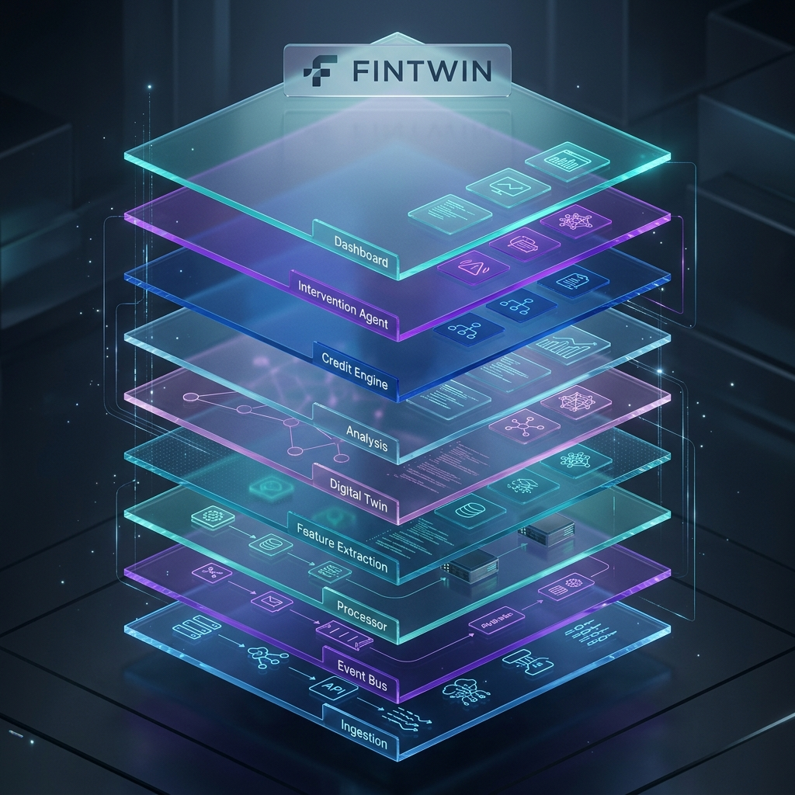
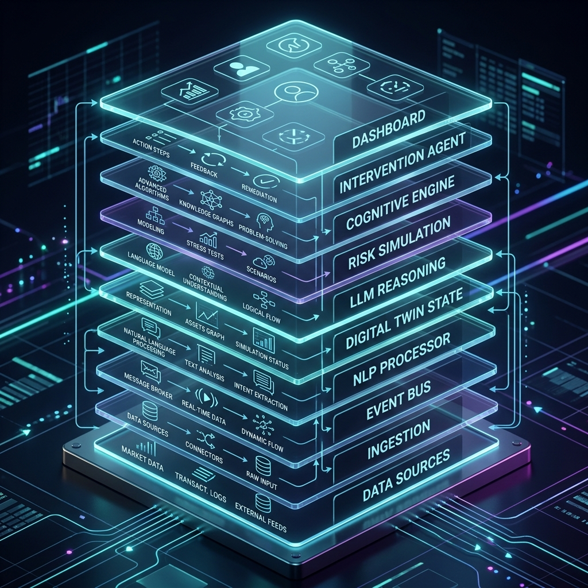

# fintwin  |  the cognitive digital twin & credit engine

> a stateful, event-driven financial intelligence platform that builds a versioned "digital twin" of a business using multi-source signals (gst, upi, sms, emi) to drive cognitive credit decisions and proactive financial interventions.



## 1. system architecture (technical)

the platform implements a **ten-tier asynchronous pipeline** that transforms raw transactional telemetry into stateful business intelligence.

```mermaid
graph LR
    %% Data Source Components
    subgraph Ingestion ["<b>TIER 1: MULTI-SOURCE INGESTION</b>"]
        direction TB
        A1["Bank APIs"]
        A2["UPI Logs"]
        A3["SMS Alerts"]
        A4["EMI Records"]
    end

    %% Bus Component
    subgraph Bus ["<b>TIER 1/2: EVENT BUS</b>"]
        B[("Redis Streams")]
    end

    %% Processing Block
    subgraph TwinEngine ["<b>TIER 2-4: TWIN ENGINE</b>"]
        direction TB
        C1["Event Classifier"]
        C2["Feature Extractor"]
        C3[("Digital Twin State")]
    end

    %% Analysis Block
    subgraph Analysis ["<b>TIER 5-9: COGNITIVE ANALYSIS</b>"]
        direction TB
        D1["LLM Reasoner"]
        D2["Risk Simulator"]
        D3["Anomaly Detector"]
    end

    %% Output
    subgraph Decision ["<b>TIER 7-10: ACTION & AUDIT</b>"]
        direction TB
        E1{"Cognitive Engine"}
        E2["Intervention Agent"]
        E3["Live Dashboard"]
    end

    %% Connections
    Ingestion --> Bus
    Bus --> C1
    C1 --> C2
    C2 --> C3
    C3 --> Analysis
    D1 & D2 & D3 --> E1
    E1 --> E2
    E2 --> E3
    Analysis --> E3

    %% Styling
    style TwinEngine fill:#e3f2fd,stroke:#1e88e5,stroke-width:2px
    style Analysis fill:#f3e5f5,stroke:#8e24aa,stroke-width:2px
    style Decision fill:#fff8e1,stroke:#fbc02d,stroke-width:2px
    style Bus fill:#f1f8e9,stroke:#7cb342,stroke-width:2px
```





> **platform dna:** the core architecture is built around the "financial digital twin"—a temporal, versioned state layer that enables what-if simulations and deep narrative reasoning.

| resource | link |
|---|---|
| mathematical foundations | [math.md](math.md) |
| tools, libraries & alternatives | [tools.md](tools.md) |
| behavioural signals | [signals.md](signals.md) |
| digital twin state schema | [schema.md](schema.md) |
| proactive agent logic | [intervention.md](intervention.md) |
| api & worker architecture | [api.md](api.md) |
| audit & dashboard | [frontend.md](frontend.md) |

---

## 2. project overview

### what this system is

fintwin is a **ten-tier financial intelligence stack** that transcends traditional credit scoring. it produces a **live digital twin** of an msme by ingesting heterogeneous signals—bank APIs, UPI logs, SMS alerts, and EMI records—to create a "DNA fingerprint" of business health. this twin drives a **cognitive credit engine** capable of narrative reasoning, predictive risk simulation (monte carlo), and autonomous interventions (proactive nudges and micro-loan pushes).

## 3. challenge tiers at a glance

| sr no. | pillar | focus area |
|---|---|---|
| 1 | **multi-source signal ingestion** | bank transactions, upi logs, sms alerts, emi schedules, open-banking feeds |
| 2 | **event stream processor** | real-time typed financial event classification and sliding-window aggregation |
| 3 | **behavioural feature engine** | spending volatility, income stability, peer cohort benchmarking, trend detection |
| 4 | **digital twin state layer** | stateful, versioned user financial twin with dna fingerprint and temporal replay |
| 5 | **llm reasoning layer** | narrative intelligence, chain-of-thought reasoning, contradiction detection |
| 6 | **predictive risk simulation** | monte carlo risk projections, stress tests, recovery path modelling |
| 7 | **cognitive credit engine** | behaviour-aware dynamic credit decisioning with bureau integration |
| 8 | **proactive intervention agent** | autonomous contextual financial nudges, micro-loan push, emi negotiation |
| 9 | **anomaly & deception detection** | fraud signals, scam defence, synthetic identity scoring |
| 10 | **audit repository & dashboard** | full-stack live dashboard, what-if simulation, regulatory audit export |

---

## 4. deep dive features

### tier 4: digital twin state layer
beyond a flat database, the **digital twin** is an event-sourced object that maintains the "DNA" of the MSME.
*   **temporal replay:** `/audit/replay` allows the system to reconstruct the exact financial state at any millisecond.
*   **dna fingerprinting:** creates a unique behavioral signature derived from spending cadence and counterparty entropy.

### tier 5: llm reasoning (narrative intelligence)
uses **phi-3 mini** with GBNF grammar constraints to generate "Reasoning Reports" that explain credit decisions in plain language, citing specific sliding-window anomalies.

### tier 8: proactive intervention agent
independent of the user, the agent monitors the twin for cashflow stress.
*   **micro-loan push:** if it detects a ₹5,000 EMI failure risk in the next 48 hours, it automatically pushes a short-term credit offer.
*   **contextual nudges:** "Your UPI velocity is down 20% vs your peers—check your inventory levels."

---

## 5. mathematical foundations

**spending volatility (z-score) — [`src/features/engine.py`](src/features/engine.py:88):**
$$\sigma_{30d} = \sqrt{\frac{\sum (v_i - \bar{v})^2}{n}}$$

**income stability index:**
$$isi = \frac{\mu_{monthly\_inbound}}{\text{cv}_{monthly\_inbound} + 1}$$

**monte carlo risk projection:**
$$p(\text{default}) = \frac{1}{n} \sum_{k=1}^{n} \mathbb{1}(\text{state}_k \in \text{insolvency})$$

---

## 6. system bootstrapping

### installation
```bash
# install the core engine
pip install -e .

# install the frontend dashboard
cd frontend && npm install && cd ..
```

### run the online pipeline
```bash
# starts redis, the workers, the api, and the frontend
./scripts/run_online.sh
```

---

<p align="center">
  <strong>fintwin</strong> — built for the airavat hackathon<br>
  <em>team pookies</em>
</p>
